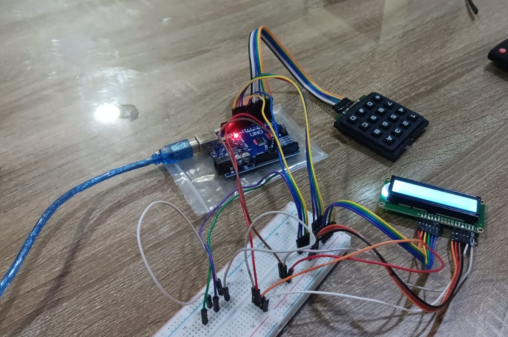
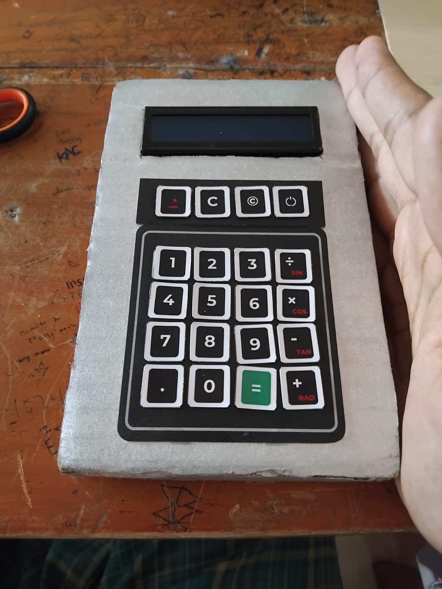

# Arduino Calculator
Just a simple arduino calculator that I made for a school project

# Dependencies
The code requires the following dependencies to work:
1. Wire
2. LiquidCrystal_I2C
3. Keypad

# Components
Assembly requires components from below, components apart from the SBC is from off-the-shelf no name products:
1. Arduino (Tested with: Arduino Uno Atmega 328P)
2. LCD Screen (16x2)
3. Keypad (3x3)

# Pictures
Prototype: 
Product: 